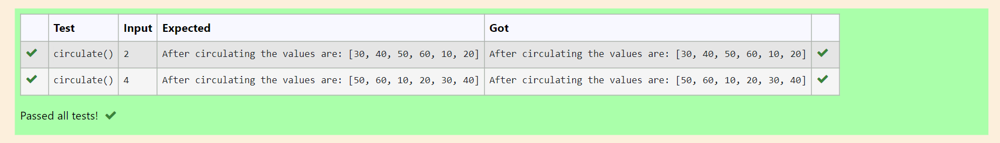

# Circulate-the-values-of-N-variables
## Aim:
To write a python program to circulate the n variables using function concept
## Equipment’s required:
PC
Anaconda - Python 3.7
## Algorithm: 
### Step 1:
Define the function to circulate variables.
### Step 2:
Assign the given values in a list.
### Step 3: 
Get the value from the user for the number of rotation.
### Step 4: 
Using the slicing concept rotate the list.
### Step 5:
Assign the variable for the new list after slicing.
### Step 6:
Print the variable.  
### Step 7:
End of the program.
## Program:
```
def circulate():
    l=[10,20,30,40,50,60]
    n=int(input())
    output=l[n:]+l[:n]
    print("After circulating the values are:",output)
```
## Output:

## Result:
Thus, circulating the n variables is succesfully executed.